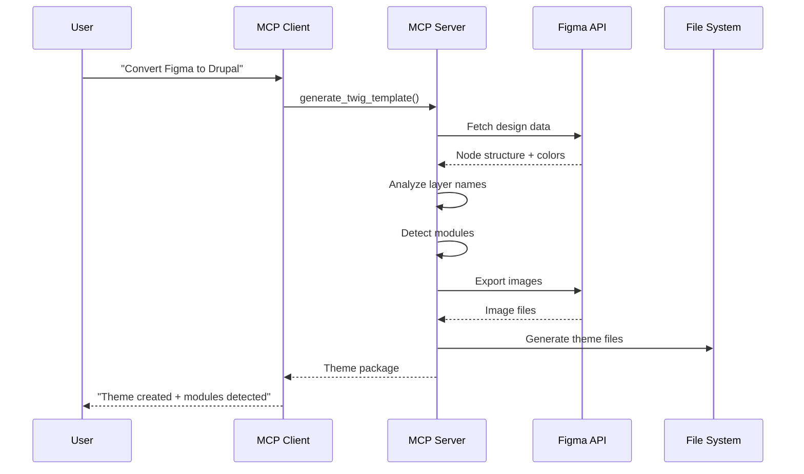

# Figma to Drupal Theme Generator - MCP Server POC

An MCP (Model Context Protocol) server that **automatically converts Figma designs into Drupal themes** with intelligent module detection.

## What This Does

Converts a Figma design URL into a Drupal theme in minutes:

```
Figma Design → [MCP Server] → Complete Drupal Theme
  (1 URL)                      - theme.info.yml (with auto-detected modules)
                               - SCSS files with design tokens
                               - Twig templates
                               - Exported images
                               - composer.json, package.json
                               - Complete folder structure
```

**Time Saved:** ~6-8 hours of manual scaffolding → 2-5 minutes automated

## Key Features

### **Automatic Module Detection** (Unique Feature)
Analyzes your Figma design and automatically detects which Drupal modules you need:
- Layer named "Product Carousel" → detects `easy_carousel`
- Layer named "Newsletter Form" → detects `webform`
- Layer named "Social Links" → detects `social_media_links`
- And 11+ more module patterns

### **Complete Theme Generation**
- Bootstrap Barrio-based theme structure
- SCSS files with Figma colors as CSS variables
- Twig templates (page, node, paragraph)
- Gulp build system
- All images exported and organized

### **Smart Design Analysis**
- Extracts color palette from Figma
- Exports images at 2x resolution
- Generates semantic HTML structure
- Creates responsive CSS boilerplate

## Why Use This?

**Without this tool:**
- 4-8 hours creating theme folder structure
- Manual module research and selection
- Copy-pasting boilerplate code
- Manually exporting images
- Writing repetitive SCSS/Twig files

**With this tool:**
- 2-5 minutes for complete theme generation
- Automatic module detection from design
- Production-ready structure
- All images exported automatically
- Design tokens as CSS variables


## Quick Start

### Prerequisites
- Python 3.10+
- Figma account with Personal Access Token
- MCP-compatible client (Claude Desktop, VS Code with Copilot, etc.)

### 1. Get Your Figma Token

1. Go to https://www.figma.com/settings
2. Scroll to "Personal access tokens"
3. Click "Generate new token"
4. Copy the token

### 2. Install & Configure

```bash
# Clone or download this repository
cd figma-mcp-stdio-server-poc

# Create .env file
echo "FIGMA_ACCESS_TOKEN=your_token_here" > .env

# Install dependencies
pip install -r requirements.txt
```

### 3. Configure Your MCP Client

#### For Claude Desktop
Edit `~/Library/Application Support/Claude/claude_desktop_config.json`:

```json
{
  "mcpServers": {
    "figma-drupal": {
      "command": "python",
      "args": ["/absolute/path/to/figma-mcp-stdio-server-poc/server.py"],
      "env": {
        "FIGMA_ACCESS_TOKEN": "your_token_here"
      }
    }
  }
}
```

#### For VS Code (with GitHub Copilot)
Add to VS Code's `mcp.json`:

```json
{
  "servers": {
    "figma-drupal": {
          "command": "python3",
          "args": [
            "/absolute/path/to/figma-mcp-stdio-server-poc/server.py"
          ],
          "env": {
            "FIGMA_ACCESS_TOKEN": "your_token_here"
          }
        }
  }
}
```

### 4. Generate Your First Theme

In your MCP client (Claude, VS Code, etc.):

```
Use the 'figma-drupal' Convert this Figma design to a Drupal theme
https://www.figma.com/design/YOUR_FILE_KEY/YourDesign?node-id=1-182 in the output folder.
```

The MCP server will:
1. Analyze the design for required modules
2. Export all images
3. Generate complete theme structure
4. Show you installation instructions

## Example Usage

### Real Example: Converting IIYN Website

```
User: "Convert this Figma to Drupal theme:
      https://www.figma.com/design/VY7pr9pz88TulvvHuC3UNJ/NB---IIYN-Websites?node-id=1-182
      Save to output_theme folder"

MCP Server Response:
✅ Analyzed design - detected 8 modules:
   - easy_carousel (carousel components)
   - webform (newsletter forms)
   - social_media_links (social icons)
   - paragraphs (content sections)
   - views (content listings)
   - And 3 more...

✅ Theme generated in: output_theme/iiyn_website/
   - 47 files created
   - 23 images exported
   - Module dependencies added to theme.info.yml

Next steps:
1. Install modules: ddev composer require drupal/easy_carousel...
2. Copy theme to Drupal
3. Enable theme
```

## What Gets Generated

When you generate a theme, you get:

```
your_theme/
├── your_theme.info.yml          # ✨ With auto-detected module dependencies!
├── your_theme.libraries.yml     # Asset libraries
├── your_theme.theme             # PHP preprocessing hooks
├── composer.json                # Theme metadata
├── package.json                 # Node dependencies (Gulp, SASS)
├── gulpfile.js                  # Build system
├── README.md                    # Installation guide
├── INSTALL.md                   # Detailed instructions
├── css/
│   ├── style.css                # Compiled CSS
│   └── fonts.css                # Font definitions
├── sass/
│   ├── style.scss              # Main entry point
│   ├── abstracts/
│   │   ├── _variables.scss     # 🎨 Colors from Figma
│   │   ├── _mixins.scss
│   │   └── _breakpoints.scss
│   ├── base/
│   ├── components/
│   └── layout/
├── js/
│   └── global.js               # JavaScript
├── templates/
│   ├── layout/
│   │   └── page.html.twig
│   ├── content/
│   ├── paragraph/
│   └── field/
└── images/                     # 📦 All images from Figma
    └── manifest.json           # Image mapping
```

## Available MCP Tools

The server exposes **two primary output generators** and a set of helper tools.

---

### Output Generators

#### **1. `generate_twig_template`** — Complete Drupal Theme

Generates a full Bootstrap Barrio-based Drupal theme from a Figma design in one call.

**Parameters:**

| Parameter | Type | Default | Description |
|---|---|---|---|
| `fileKey` | string | required | Figma file key |
| `nodeId` | string | required | Node ID (e.g. `1-182`) |
| `themeName` | string | required | Machine name for the theme |
| `outputDir` | string | required | Directory to write the theme into |
| `detectModules` | bool | `true` | Auto-detect Drupal modules from layer names |
| `exportImages` | bool | `true` | Download all image fills from Figma |
| `generateCss` | bool | `true` | Generate SCSS/CSS with design tokens |

**Output:** Full theme folder — `.info.yml`, `libraries.yml`, `.theme`, SCSS, Twig templates, `gulpfile.js`, `package.json`, `composer.json`, exported images with `manifest.json`.

**Example prompt:**
```
Convert this Figma design to a Drupal theme:
https://www.figma.com/design/VY7pr9pz88TulvvHuC3UNJ/My-Design?node-id=1-182
Save to output folder.
```

---

#### **2. `generate_smart_html`** — Standalone HTML Page

Generates a standalone semantic HTML + CSS file from a Figma design, with no Drupal dependency.

**Parameters:**

| Parameter | Type | Default | Description |
|---|---|---|---|
| `fileKey` | string | required | Figma file key |
| `nodeId` | string | required | Node ID |
| `pageName` | string | `"Page"` | Title for the HTML page |
| `outputDir` | string | `"."` | Directory to write files into |
| `imagesDir` | string | `"./images"` | Path to exported images |

**Output:** `index.html` with inline design tokens and semantic structure derived from the Figma layer hierarchy.

**Example prompt:**
```
Generate an HTML page from this Figma design:
https://www.figma.com/design/VY7pr9pz88TulvvHuC3UNJ/My-Design?node-id=1-182
Save to output folder.
```

> **Note:** `generate_html_structure` is a deprecated alias that redirects to `generate_smart_html`.

---

### Helper Tools

| Tool | Purpose |
|---|---|
| `analyze_figma_for_drupal_modules` | Scan layer names → suggest Drupal modules |
| `auto_export_all_images` | Download all image fills via `imageRef` hashes (works inside component instances) |
| `export_images` | Export specific nodes by ID |
| `analyze_images` | List all image nodes in a design |
| `extract_colors` | Extract color palette as CSS custom properties |
| `generate_css_boilerplate` | Generate full CSS with design tokens and breakpoints |
| `create_image_manifest` | Build `manifest.json` mapping image refs to files |
| `fetch_node_data` | Return raw Figma JSON for a node |
| `whoami` | Verify the Figma token and return account info |

## Module Detection Patterns

The server detects modules by analyzing Figma layer names:

| If Figma Has... | Detects Module... |
|----------------|-------------------|
| "carousel", "slider", "slideshow" | `easy_carousel`, `slick` |
| "form", "newsletter", "subscribe", "contact" | `webform` |
| "social", "facebook", "twitter", "instagram" | `social_media_links` |
| "testimonial", "review", "quote" | `testimonials` |
| "gallery", "media", "video" | `media` |
| "section", "component", "paragraph" | `paragraphs` |
| "view", "list", "grid", "table" | `views` |
| "accordion", "tabs", "fieldset" | `field_group` |
| "search", "filter", "facet" | `search_api` |

**Pro Tip:** Use semantic layer names in Figma for better detection!

## Installation After Generation

Once your theme is generated, install it in Drupal:

```bash
# 1. Install detected modules (example from IIYN theme)
cd /path/to/your/drupal
ddev composer require 'drupal/easy_carousel:^1.2'
ddev composer require 'drupal/webform:^6.0'
ddev composer require 'drupal/social_media_links:^2.9'
ddev composer require 'drupal/paragraphs:^1.0'
# ... other detected modules

# 2. Enable modules
ddev drush en easy_carousel webform social_media_links paragraphs -y

# 3. Copy theme to Drupal
cp -r output_theme/your_theme web/themes/custom/

# 4. Enable theme
ddev drush theme:enable your_theme
ddev drush config:set system.theme default your_theme -y

# 5. Clear cache
ddev drush cr

# 6. Get admin login URL
ddev drush uli
```

## Server Log

The server writes all activity to a log file pinned to the server directory:

```
/path/to/figma-mcp-stdio-server-poc/figma_mcp.log
```

This file is always created next to `server.py` regardless of which directory the MCP client launches from. Nothing is written to `stderr`, so no noise appears in the VS Code output panel.

To tail the log while running:
```bash
tail -f /path/to/figma-mcp-stdio-server-poc/figma_mcp.log
```

## Documentation

- **[CHANGELOG.md](./CHANGELOG.md)** - Version history

## How It Works



## Technical Details

- **MCP Protocol:** stdio transport (JSON-RPC)
- **Figma API:** REST API v1 with Personal Access Tokens
- **Framework:** FastMCP (Python)
- **Output:** Bootstrap Barrio-based Drupal theme
- **Module Detection:** Pattern matching on layer names
- **Image Export:** Parallel batch export at 2x resolution

## Why Not Use Figma's Official MCP?

| Figma Official MCP | This Server |
|-------------------|-------------|
| ❌ Requires Desktop App | ✅ Headless/CLI |
| ❌ Manual module selection | ✅ Auto-detection |
| ❌ Generic code output | ✅ Drupal-specific |
| ❌ No theme structure | ✅ Complete theme |
| ✅ Real-time sync | ❌ Point-in-time |

## Troubleshooting

### Server won't start
```bash
# Check Python version (need 3.10+)
python --version

# Check if .env exists
ls -la .env

# Check token is set
cat .env
```

### Images not exporting
- `auto_export_all_images` uses `imageRef` hashes (not node IDs), so it works correctly even when images are inside component instances
- If using `export_images` directly, avoid node IDs starting with `I` or containing `;` — those are instance overrides and cannot be exported by ID
- Use `analyze_images` to list all image nodes and their IDs
- Check `figma_mcp.log` (see Server Log below) for detailed error output

### Theme errors in Drupal
- Check theme.info.yml syntax
- Install required base theme: `ddev composer require drupal/bootstrap_barrio`
- Clear cache: `ddev drush cr`

## Contributing

Contributions welcome! Areas for improvement:
- Additional module patterns
- Support for more Drupal versions
- Additional framework support (React, Next.js)
- Improved Twig template generation

## Credits

Built with:
- [FastMCP](https://github.com/jlowin/fastmcp) - Python MCP framework
- [Figma REST API](https://www.figma.com/developers/api) - Design data source
- [Bootstrap Barrio](https://www.drupal.org/project/bootstrap_barrio) - Base theme

## Contact

Eduardo Arana - eduardo.arana@es.nestle.com

---

**Version:** 1.2.0  
**Last Updated:** March 10, 2026
